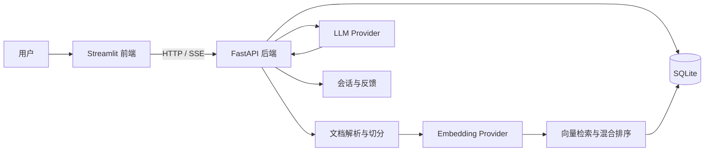
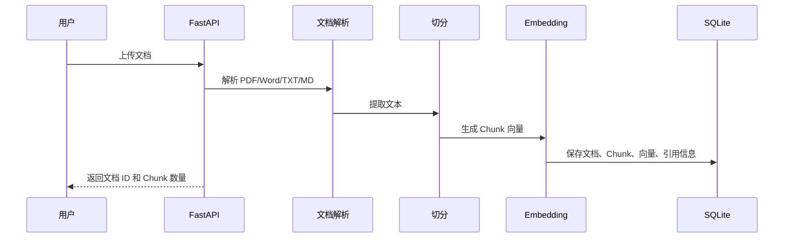
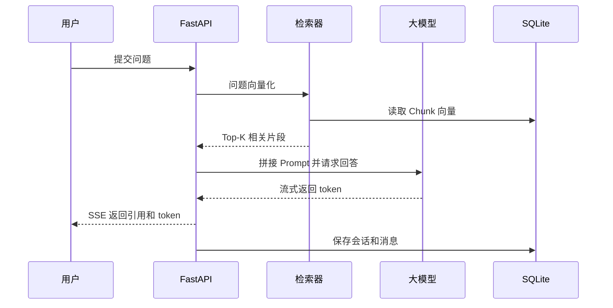
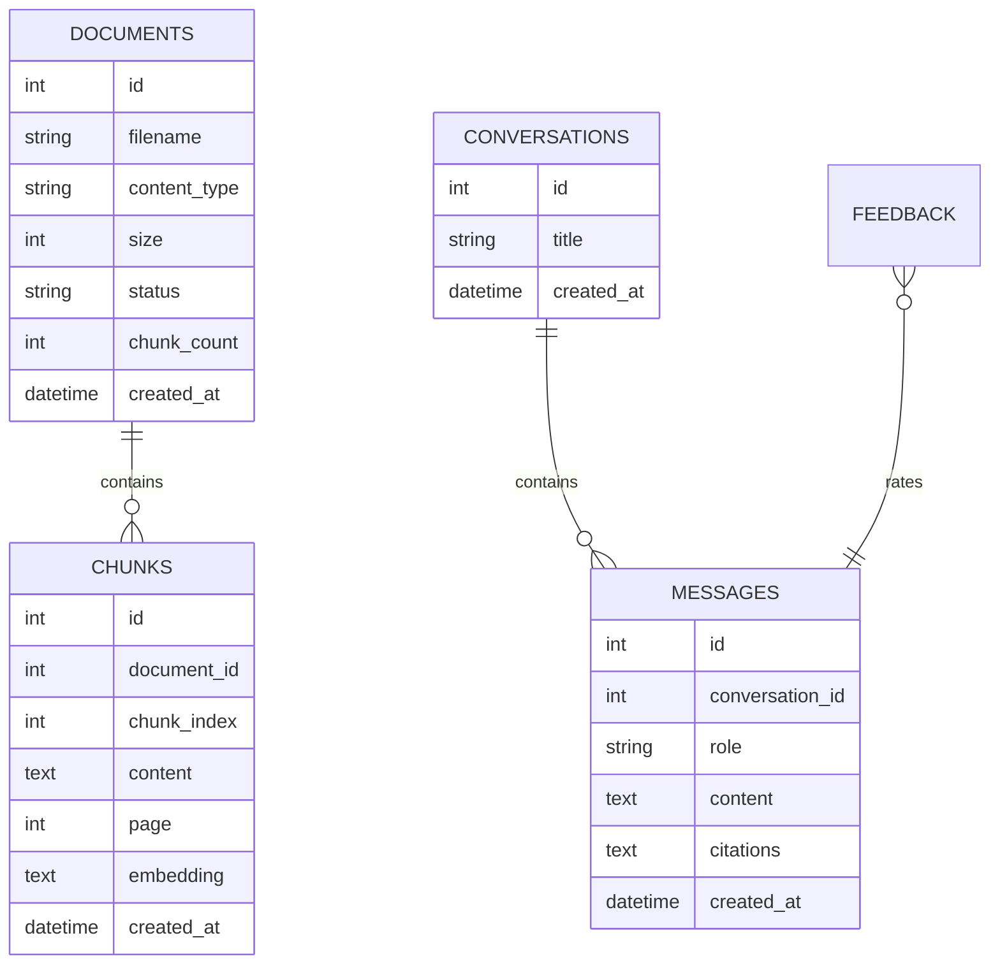

# 项目架构

## 整体架构

## 文档入库流程

## 问答流程

## 数据模型

## 升级路线

1. 将 SQLite 检索替换为 Chroma 或 Milvus。
2. 加入 BGE-M3 Embedding 和 bge-reranker。
3. 增加 Query Rewrite 和多轮对话改写。
4. 增加文档权限、部门隔离和审计日志。
5. 增加评测集、指标看板和链路追踪。